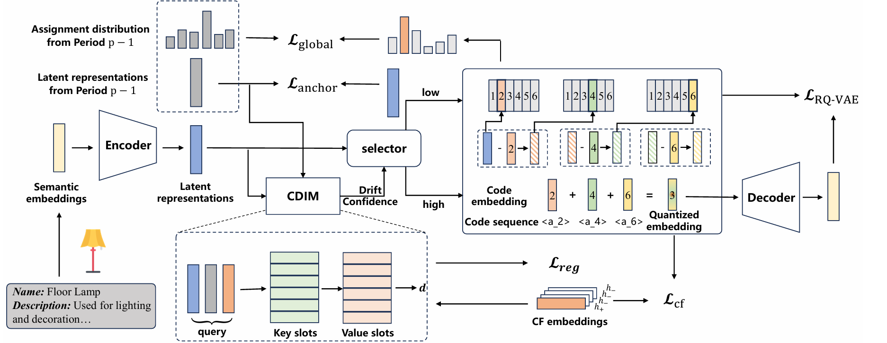
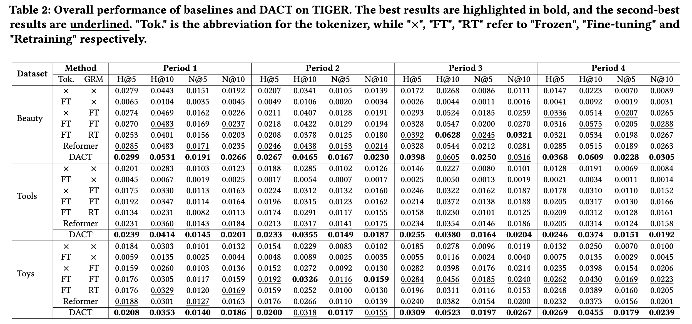
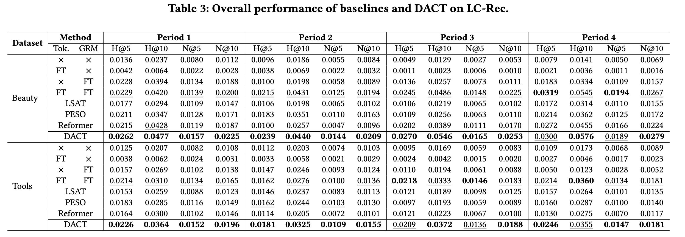

# DACT: Drift-Aware Continual Tokenization for Generative Recommendation

<p align="center">
  <a href="https://arxiv.org/abs/2603.29705"></a>
  <a href="https://doi.org/10.1145/3805712.3809645"></a>
  

</p>

> **Drift-Aware Continual Tokenization for Generative Recommendation**  
> Yuebo Feng, Jiahao Liu, Mingzhe Han, Dongsheng Li, Hansu Gu, Peng Zhang, Tun Lu, Ning Gu  
> *ACM SIGIR 2026*  
> [[Paper]](https://arxiv.org/abs/2603.29705) · [[DOI]](https://doi.org/10.1145/3805712.3809645)

---

## Overview

Generative recommendation systems adopt a two-stage pipeline: a learnable **tokenizer** maps items to discrete token sequences (identifiers), and an autoregressive **generative recommender model (GRM)** performs prediction from these identifiers. While recent tokenizers incorporate collaborative signals so that items with similar user-behavior patterns receive similar codes, real-world environments evolve continuously:

- **New items** cause identifier collision and shifts.
- **New interactions** induce *collaborative drift* in existing items (e.g., changing co-occurrence patterns and popularity).

Fully retraining both tokenizer and GRM is prohibitively expensive, yet naively fine-tuning the tokenizer can alter token sequences for the majority of existing items, undermining the GRM's learned token-embedding alignment.

**DACT** balances plasticity and stability through two stages:

1. **Tokenizer Fine-tuning** — augmented with a jointly trained *Collaborative Drift Identification Module* (**CDIM**) that outputs item-level drift confidence and enables differentiated optimization for drifting vs. stationary items.
2. **Hierarchical Code Reassignment** — a relaxed-to-strict strategy that updates token sequences while limiting unnecessary changes.



---

## Method

### Stage 1 · Tokenizer Fine-tuning with CDIM

The CDIM operates alongside the tokenizer and produces a per-item drift confidence score. Items identified as drifting receive stronger gradient updates, while stationary items are regularized to preserve their existing codes. This differentiates optimization pressure without requiring any manual labeling of drift.

### Stage 2 · Hierarchical Code Reassignment

After fine-tuning, a hierarchical reassignment procedure updates the token sequences using a **relaxed-to-strict** schedule: coarse-level code changes are allowed first, then progressively constrained at finer levels. This reduces cascading disruption to the GRM's token-embedding alignment.

---

## Getting Started

### Requirements

```bash
pip install -r requirements.txt
```

### DACT Tokenizer

**Train**
```bash
cd rqvae
bash finetune_book_dact.sh
```

**Tokenize**
```bash
cd rqvae
bash generate_code_dact.sh
```

### Downstream GRM

**TIGER backbone**
```bash
cd TIGER-backbone
bash finetune.sh
```

**LC-Rec backbone**
```bash
cd LC-Rec-backbone/scripts_qwen
bash train.sh
```

---

## Results

DACT consistently outperforms baselines across three real-world datasets (Beauty, Tools, Toys) and two representative GRMs (TIGER, LC-Rec) over four continual learning periods, demonstrating effective adaptation to collaborative evolution with reduced disruption to prior knowledge.

### TIGER Backbone

> "Tok." = Tokenizer strategy; "×" = Frozen, "FT" = Fine-tuning, "RT" = Retraining.  
> **Bold** = best, <u>underline</u> = second-best.



### LC-Rec Backbone



---

## Citation

If you find this work useful, please cite:

```bibtex
@inproceedings{feng2026dact,
  title     = {Drift-Aware Continual Tokenization for Generative Recommendation},
  author    = {Feng, Yuebo and Liu, Jiahao and Han, Mingzhe and Li, Dongsheng and
               Gu, Hansu and Zhang, Peng and Lu, Tun and Gu, Ning},
  booktitle = {Proceedings of the 49th International ACM SIGIR Conference on
               Research and Development in Information Retrieval},
  year      = {2026},
  doi       = {10.1145/3805712.3809645}
}
```

---

## Contact

For questions or issues, please open a GitHub issue or contact the authors.
